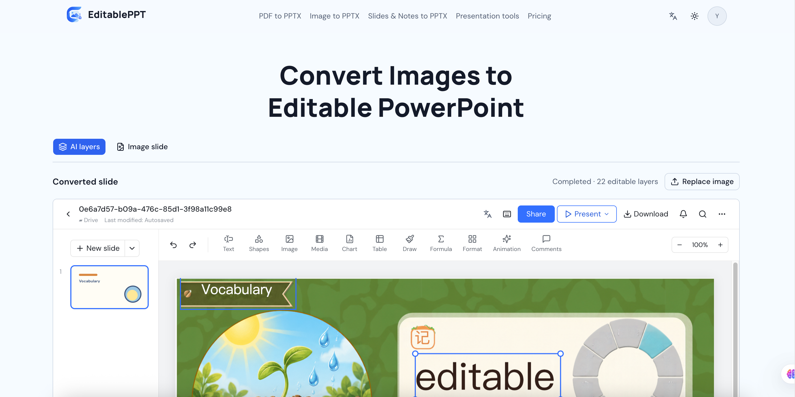
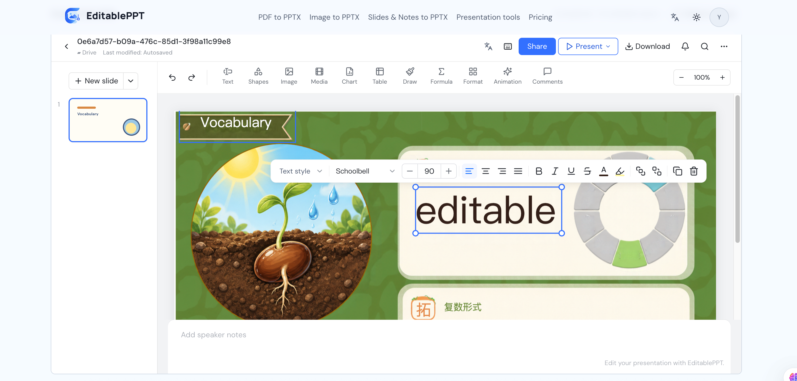
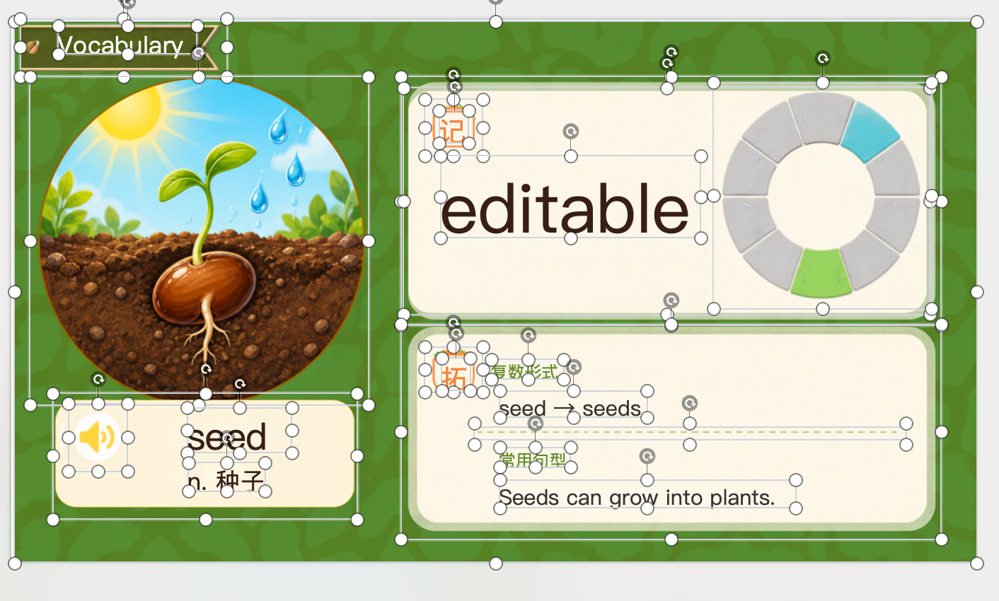

<p align="center">
  <a href="https://editableppt.com"></a>
</p>

# EditablePPT Image to PPT

官网：[editableppt.com](https://editableppt.com) · [在线将图片转换为可编辑 PowerPoint](https://editableppt.com/image-to-pptx)

把 ChatGPT、Nano Banana 或其他工具生成的 PNG/JPG 图片转换为可编辑的 PowerPoint。这个仓库提供 **Codex 插件 + skill + 本地 MCP 工具**：用户在 Codex 中给出一张或多张图片，MCP 将图片交给 EditablePPT 的 AI 图层拆分服务，按输入顺序合并为一个 `.pptx`。

图片中的文字、形状和图像会尽可能拆成独立的 PowerPoint 对象。复杂效果、字体和识别结果可能需要在 PowerPoint 中调整；这不是把原图作为单个不可编辑对象嵌入。

## 效果预览

在 [EditablePPT 网站](https://editableppt.com) 转换图片后，可以在网页编辑器中调整识别出的元素，并下载 PPTX 继续在 PowerPoint 中编辑。







## 安装

需要 Node.js 22+ 和 Codex。运行：

```bash
codex plugin marketplace add a474516631/editableppt
codex plugin add editableppt-image-to-ppt@editableppt
```

安装后开启一个新的 Codex 任务，使 MCP 工具和 skill 生效。插件源码位于 [`plugins/editableppt-image-to-ppt/`](plugins/editableppt-image-to-ppt/)；marketplace 清单位于 [`.agents/plugins/marketplace.json`](.agents/plugins/marketplace.json)。

## 授权

首次使用时，在 [EditablePPT API Keys](https://editableppt.com/settings/apikeys) 登录并创建一个名为 `Codex MCP` 的 API Key。运行 skill 时，它会引导你在交互式终端输入密钥。**不要把密钥发到聊天窗口或提交到 Git。** 密钥仅保存在本机 `~/.config/editableppt/mcp-auth.json`（权限 `0600`）；也可通过 `EDITABLEPPT_API_KEY` 环境变量提供。删除网站上的 API Key 即可撤销授权。

本地开发可运行 `node plugins/editableppt-image-to-ppt/server.mjs auth --base-url=http://localhost:3000`，或设置 `EDITABLEPPT_BASE_URL`。生产环境默认连接 `https://editableppt.com`。

## 使用

在新的 Codex 任务中运行 `$editableppt-image-to-ppt:image-to-ppt`，提供本地图片路径或附上图片，并说明顺序，例如：

> 把 `/Users/me/slides/cover.png` 和 `/Users/me/slides/chart.jpg` 按顺序转换成一份可编辑 PPT，标题为“产品汇报”。

skill 会调用 `convert_images_to_pptx` 启动转换，再调用 `get_conversion_status` 查询结果。默认将 PPTX 保存在第一张图片旁边；可指定绝对输出路径。已有文件不会被覆盖。

- 输入：1–20 张 PNG/JPG，每张不超过 8 MB、2500 万像素。
- 输出：一份 `.pptx`，幻灯片顺序与输入顺序一致。
- 转换：可能需要数分钟；多张图片会依次处理，并遵守服务端限流。
- 隐私：AI 转换会将图片上传到 EditablePPT 服务处理，请勿提交不适合上传的敏感图片。

详细操作与示例结果见 [Demo 说明](docs/demo.md)。

## 服务端要求

插件依赖 EditablePPT 网站的 `/api/image-conversions`、`/advance`、`/auth` 和 `/export` 接口。其中授权与合并导出接口需部署到线上后，公开安装的插件才能使用生产服务。当前仓库只发布 MCP 客户端和 skill，不包含网站后端或 Canva 凭据。没有已配置的转换服务时，工具会返回明确错误，不会生成 PPTX。

## 开发验证

```bash
node --test tests/editableppt-mcp.test.mjs
```

测试使用本地模拟 API，覆盖 MCP 握手、工具发现、多图片顺序转换和 PPTX 写入；它不调用真实的 AI 服务。

MIT License，见 [LICENSE](LICENSE)。
